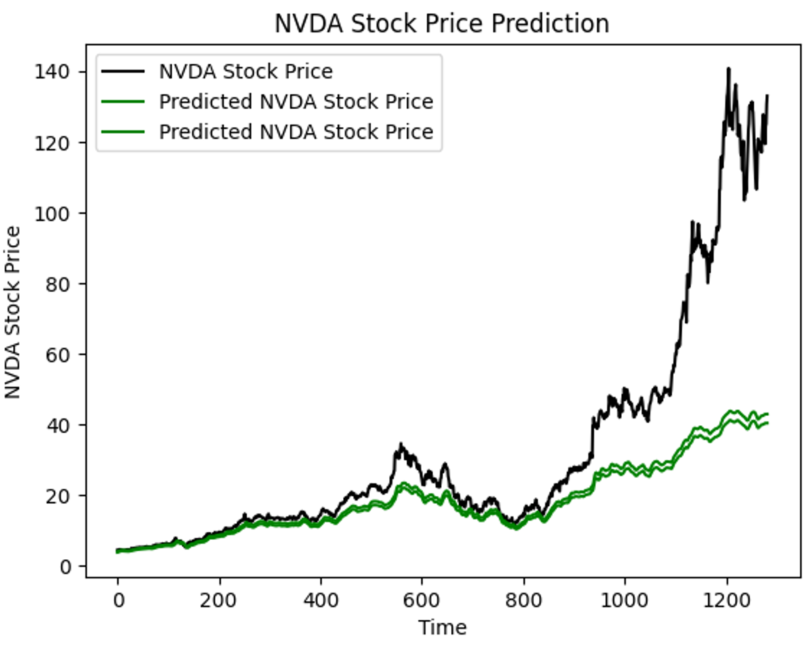

# Time Series Prediction Using LSTM and Comparison with Other Algorithms

This project explores time series data prediction using several algorithms, with a primary focus on Long Short-Term Memory (LSTM) networks. The comparison includes Recurrent Neural Networks (RNNs) and Gradient Boosting Machines (GBMs). Our dataset includes stock prices collected over time, allowing for an evaluation of each algorithm’s performance in handling sequential, temporal data and includes implementing LSTM from scratch.

## Project Structure

- **LSTM**: Contains the LSTM model implementation for time series data prediction.
- **RNN**: Includes a Recurrent Neural Network model using TensorFlow and Keras.
- **GBM**: Implements Gradient Boosting Machine for comparison.

Each model is structured with a comparable configuration for a fair comparison in terms of neurons, layers, and activation functions.

## Introduction to LSTM

Long Short-Term Memory (LSTM) networks are specialized Recurrent Neural Networks (RNNs) that address the challenge of long-term dependencies in sequence data. Unlike standard RNNs, which can struggle to maintain information over long sequences, LSTM cells retain relevant information across timesteps, making them ideal for time series forecasting.



*Figure 1: Prediction of LSTM model.*

## Model Comparisons

| Algorithm        | Description                                                                                          | Performance               |
|------------------|------------------------------------------------------------------------------------------------------|---------------------------|
| **LSTM**         | Memory-augmented RNNs capable of retaining long-term information, suitable for time-dependent data.  | Highest accuracy overall. |
| **RNN**          | Standard RNN with recurrent connections but prone to vanishing gradient issues for longer sequences.  | Moderate performance.     |
| **Gradient Boosting Machine (GBM)** | Boosting technique for creating strong predictive models from sequential data features. | Effective, less accurate than LSTM. |

### Key Findings

- **LSTM**: Provided the best results with a robust capacity for capturing long-term dependencies in the stock data.
- **RNN**: Showed reasonable performance but struggled with longer sequences due to the vanishing gradient problem.
- **GBM**: A powerful algorithm, especially effective with lagged features but less suited for directly modeling sequential dependencies compared to LSTM.

## Running the Project

1. **Data Collection**: Run `data_scraper.py` to fetch stock prices from Yahoo Finance.
2. **Model Training**: Each model can be trained by running the `main.py` file in its respective directory.
3. **Results**: Each model prints its loss metrics, allowing for side-by-side performance evaluation.

## Requirements

- Python 3.x
- TensorFlow and Keras
- Scikit-learn
- XGBoost
- Pandas, Numpy, Matplotlib

Install requirements:
```bash
pip install -r requirements.txt
